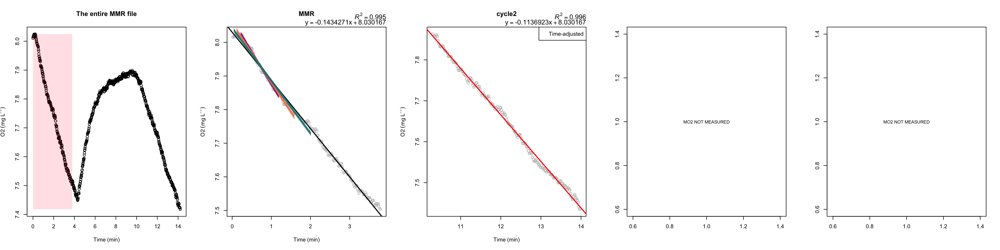
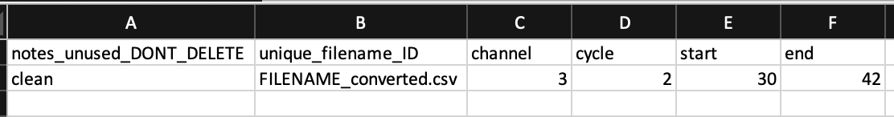
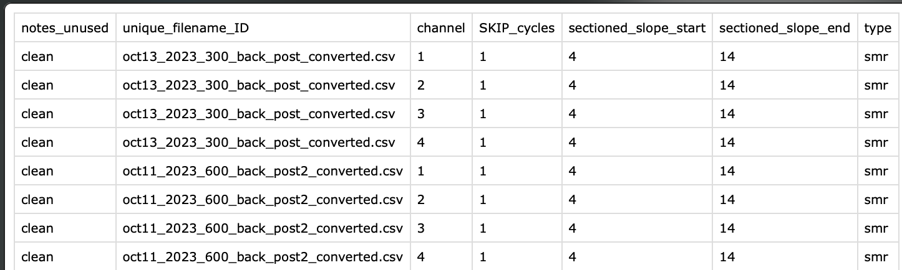
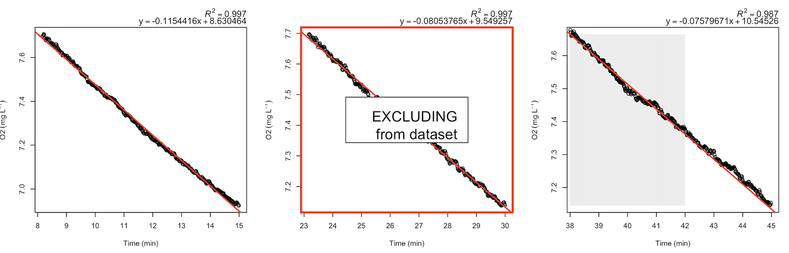
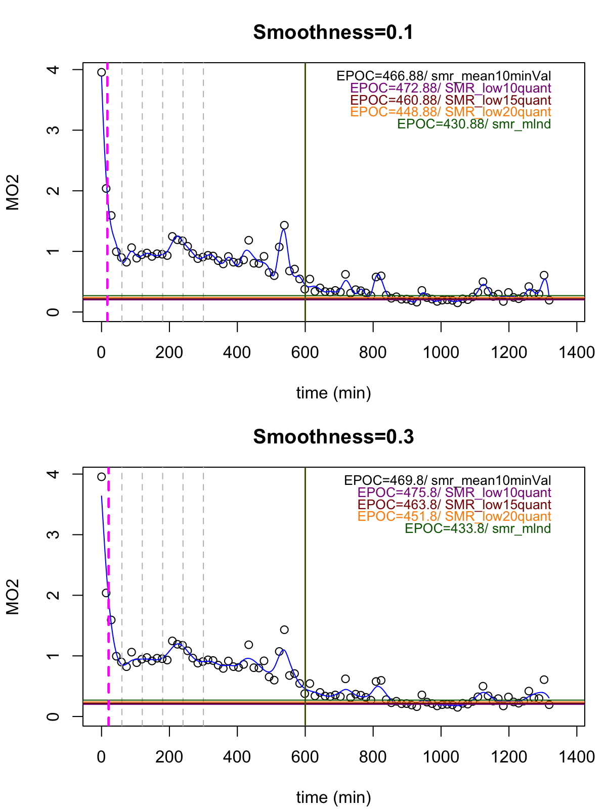
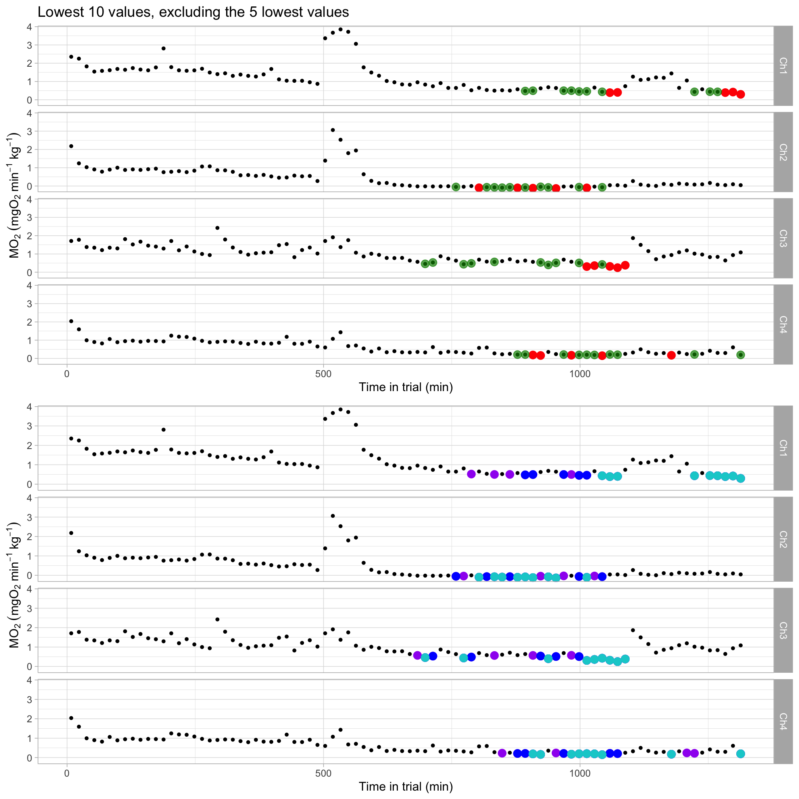
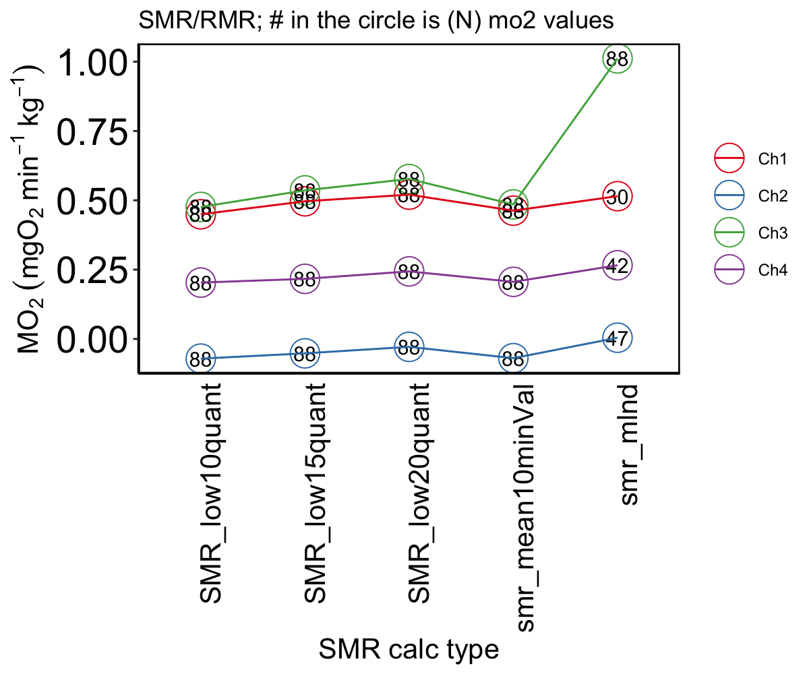

```{r setup, include=FALSE}
knitr::opts_chunk$set(echo = TRUE)
```


## Setup

#### 1. (done once) Install Library

``` r
install.packages("devtools") # if devtools is not installed
devtools::install_github("kraskura/AnalyzeResp")
library(AnalyzeResp)

```

#### 2. (done once) Set up analysis working directory space
 
Using these functions, produce and save locally many .csv and .png files.
Currently, there are two options:
  
* in the current  working directory (folder on the user’s computer).
* in various folders automatically organised (suggested). 

To setup the current working directory with all subfolders run the following code:

``` r
organizeAnalysisLocally(create = "Full") # will create a full suite of folders and subfolders within in prep to analyze SMR, MMR, AAS

```

_Note! Do not rename the folders. Much agreed that the names of these folders are not intuitive in the current version. Suggestions with alternative names for the export files, directories, and sub-directories are always welcome_

**Outcome**


<br>

#### 3. (done once) Transition from raw data .txt files to .csv files

The location of raw files: the root working directory. Then execute the code:

``` r

# For Witrox 
textFileConvert(txt_file = "NAME_OF_RAW_TEXTFILE.txt",
                local_path = FALSE,
                type_file = "Witrox",
                N_Ch = 4,
                nrowSkip = 41, # witrox software 2023 
                convert_units = T,
                units_from = "pct", # O2 units from % AS
                units_to = "mg/L", # O2 units to mg/L
                salinity = 0,
                atm_pressure = 1)

# example for 'older' Firesting: 
textFileConvert(txt_file = "NAME_OF_RAW_TEXTFILE.txt",
                local_path = FALSE,
                type_file = "Firesting_pre2023",
                N_Ch = 4,
                nrowSkip = 19, # pyroscience old software 
                convert_units = T,
                units_from = "pct", # O2 units from % AS
                units_to = "mg/L", # O2 units to mg/L
                salinity = 0,
                atm_pressure = 1)
                
# For Firesting after 2023 update
textFileConvert(txt_file = "NAME_OF_RAW_TEXTFILE.txt",
                local_path = FALSE,
                type_file = "Firesting_2023",
                N_Ch = 4,
                nrowSkip = 70, # 
                convert_units = T,
                units_from = "pct", # O2 units from % AS
                units_to = "mg/L", # O2 units to mg/L
                salinity = 0,
                atm_pressure = 1)                

```

The data files are in .txt (Firesting oxygen meter) or .csv (Witrox) format when in raw form. The functions in this package processes .csv files that contain values only relevant for the  analysis (e.g., O~2~, temperature, time).

The `MMR_SMR_AS_EPOC` calculates metabolic rates in mgO~2~ L^-1 kg^-1. When the oxygen level unit in the raw data files is not mgO~2~ L^-1, it will require conversion. 

  + Common conversion: from air saturation % (AS%) to mgO~2~ L^-1
  + The function depends on rMR::DO.unit.convert and is a modified version of it. 
    * Similarly, also see similar modification: [FishResp::conver.rMR](https://www.rdocumentation.org/packages/FishResp/versions/1.1.0/topics/convert.rMR)
  + This must be done on each file
    * Suggesting writing a `for` loop for efficiency (see code example below)


Outcomes:
  
  The original non-modified .txt file remains in the current working directory. The .txt files can now be moved elsewhere as they are not used in any consecutive steps. The new file will have and extension '_convereted.csv" and will be moved to csv_files folder.

<br>
<br>

## Using MMR function

 The following script is to obtain oxygen decrease rates over time during a user-specified measurement cycle. This code analyzes MMR in up to 4 individuals, each associated with one probe = channel in FireSting oxygen sensor (FireSting boxes). 

  If the MMR data file contains less than 3 min of data, the iterative "sliding window" analysis to find the steepest slope representing MMR measurement is not performed. Otherwise, it always calculates the regression parameters for the provided duration of the measurement.

### 1. First MMR analysis run

```

MMR(data.MMR = "NAME_OF_DATA_converted.csv", # specify the .csv data file
    cycles = 2,  # this file has two measurement (closed phase) cycles
    cycle_start = c(0, 11.02), # first cycle start at 0 min, and 2nd cycle starts at 11.2 min (relative time of the file)
    cycle_end = c(4.0, 15.95), # first cycle ends at 4 min, and 2nd cycle ends at 15.95 min (relative time of the file)
    mmr_Ch1 = 1, # an animal in channel 1 has the MMR measured in the first cycle. 
    mmr_Ch2 = 2, # an animal in channel 2 has the MMR measured in the second cycle. 
    mmr_Ch3 = 1, # an animal in channel 3 has the MMR measured in the first cycle. 
    mmr_Ch4 = 2, # an animal in channel 4 has the MMR measured in the second cycle. 
    clean_Ch1=c(0,0), # channel specific timeframes for the MMR measurement
    clean_Ch2=c(0,0), 
    clean_Ch3=c(0,0),
    clean_Ch4=c(0,0),
    local_path = TRUE, # this will automatically save output files in the dedicated output folders
    N_Ch = 4, # 4 channel firesting, 1 temperature probe
    inv.data = NA) # no inventory data to perform more detailed user-defined measurement adjustments. 

```

Outcomes:

#### plot 1.



  - one figure produced per individual 
  - the first panel always has the full duration of the trend presented, and the shaded section shows the user-indicated MMR section 
  - the user-indicated MMR cycle plot, in this case, is the first measurement cycle. 
    * The plot is labeled MMR (second panel)
    * The colored slopes are the steepest i) 120 s (green), ii) 90 s (orange), iii) 60 s (purple); black regression is for a full duration
  _ regressions parameters of all full slopes are noted above the plot
  _ if any (not MMR) measurement cycle  is adjusted using 'inventory file,' it will be indicated in the legend box (see third panel, cycle 2)


  <br>

 
### 2. QC MMR (optional)

MMR inventory or channel-specific cleaning: What is it and how to use it? The 'cleaning details' are provided and outlined in csv file. 



  Column | Description 
  ---:| :----------- 
  **notes_unused_DONT_DELETE** | Column intentionally left blank for user notes. Do not delete 
  **unique_filename_ID** | A full filename as entered in the MMR function. 
  **channel** | The Number of the channel (1-4)
  **start** |  indicate the start time (minutes) of the measurement section to be KEPT; add 0 to discard this cycle.
  **end** | indicate the end time of the section to be KEPT; add 0 to discard this cycle.


  Description from the example image above:

  - Channel 3, not-MMR measurement cycle 2 needs to be time-adjusted. 
  - The entered filename is matching exactly the filename for the data file
  - When `MMR` function is applied to this file, the timeframe of usable data for channel 3, cycle 2 will be adjusted to start time at minute 30 and end at minute 40 (relative time in the data, assuming the file begins at time 0 min). 

  Notes:

  - Be sure that the format of the inventory file is .csv and the inventory file is located in the root working directory (same location as MMR, SMR, ... folders).**
  - To clean actual MMR cycle (sliding slope section), use `MMR` arguments `clean_Ch1, clean_Ch1, clean_Ch1, clean_Ch1` as needed.

<br>

Now, run the code again with inventory file:

``` r
MMR(data.MMR = "NAME_OF_DATA_converted.csv", # specify the .csv data file
    cycles = 2,  # this file has two measurement (closed phase) cycles
    cycle_start = c(0, 11.02), # first cycle start at 0 min, and 2nd cycle starts at 11.2 min (relative time of the file)
    cycle_end = c(4.0, 15.95), # first cycle ends at 4 min, and 2nd cycle ends at 15.95 min (relative time of the file)
    mmr_Ch1 = 1, # an animal in channel 1 has the MMR measured in the first cycle. 
    mmr_Ch2 = 2, # an animal in channel 2 has the MMR measured in the second cycle. 
    mmr_Ch3 = 1, # an animal in channel 3 has the MMR measured in the first cycle. 
    mmr_Ch4 = 2, # an animal in channel 4 has the MMR measured in the second cycle. 
    clean_Ch1=c(0,0), # channel specific timeframes for the MMR measurement
    clean_Ch2=c(0,0), 
    clean_Ch3=c(0,0),
    clean_Ch4=c(0,0),
    local_path = TRUE, # this will automatically save output files in the dedicated output folders
    N_Ch = 4, # 4 channel firesting, 1 temperature probe
    inv.data = "NAME_OF_INV_DATA.csv") # no inventory data to perform more detailed user-defined measurement adjustments. 

```

<br>
<br>

## Using SMR function 

Two runs of `SMR` function for each data file may be necessary. 

  1. Parametrized run to get files for visual assessment of each measurement's quality. 
  2. Parametrized run to apply any time adjustments and cleaning, as decided after visual assessment of the data.

#### 1. First run: A parametrized run of `SMR` without any QC 

``` r

SMR(data="FILENAME_SMR_converted.csv",
    inventory_data=NA,
    cycle_start=8, # length of the flush (min 0 - 8 relative time for each measurement cycle)
    cycle_end=15, # length of a full cycle, with open and closed phases together
    chop_start=10/60, # this will take the first 10 sec off as a waiting period. It can be decimal
    chop_end=0,
    N_Ch=4,
    local_path=TRUE)

```

  The rate of oxygen decrease (O~2~ levels ~ time; e.g., mgO~2~ min^-1) for all automatically isolated measurement cycles. 
    
  From the example code above:
    + The full respirometry cycle (flush:measure) length is 15 min long: `cycle_end=15`
    + 8-minute flush: `cycle_start=8`
    + None of the measurement cycles will be modified or otherwise cleaned (no inventory data): `inventory_data=NA`
    + The first 10 s from each measurement (closed) will be discarded as "wait period" for water mixing: `chop_start=10/60` (see notes below)

  An additional wait period can be used between the flush and measurement (flush:wait:measure) [Rosewarne et al 2016, See Fig 3](https://onlinelibrary.wiley.com/doi/10.1111/jfb.12795). In the provided example, the first 10 seconds would be equivalent to wait period and excluded from regression analysis.

 
Outcomes:

##### plot 2.


  
  + A snapshot of three measurement cycles for a specific channel. There are a total of 88 measurement cycles in a full example figure. 
    * One figure produce for each channel.
    * Red line: linear regression slope
    * Regressions parameters of all full slopes are noted above the plot
    * Time is in relative scale, assuming the file begins at time 0 

  + File showing the recorded data all on one timescale
    * panels top to bottom: Channel 1 O~2~ trend, channel 2 O~2~ trend, channel 3 O~2~ trend, channel 4 O~2~ trend, temperature trend (scale is set to 5- 35ºC)]
    * in panels 1-4:
      - solid red line: the mean O~2~ levels in the system during the trial
      - the dashed line: the lowest reached O~2~ levels in the system during the trial
   + if the Channel has no data, it shows as a straight line at zero


#### 2. QC SMR (optional) 

SMR inventory or channel-specific cleaning: What is it and how to use it?

Same as MMR, the cleaning details are provided through csv file.

  

 Column | Description 
  ---:| :----------- 
  **date** | The date in 3-letter month + 2-number date (e.g. jun04, jan15, oct20, aug01... ). Important but inconvenient: excel tends to default to one of the data formats. Counteract that by typing the apostrophe before text: 'jun04 
  **SKIP_cycle**  |  Add '0' to clean the cycle, keep the times as specified in the next two columns. Add '1' to delete the cycle, add times of the cycle that needs to be deleted in the next two columns. 
  **sectioned_slope_start** |  indicate the start time (minutes) of the measurement section to be KEPT, write 0 to discard this cycle.
  **sectioned_slope_end** | indicate the end time of the section to be KEPT, write 0 to discard this cycle.
  **type** | add "smr"

Now run the SMR function again. The only addition is the inventory data file (in .csv format). The inventory file must be in the root working directory.
  

``` r
  SMR(data="FILENAME_converted.csv",
      inventory_data= "smr_inventory_test.csv", # <<< Added after visual assessment of the data
      cycle_start=8, 
      cycle_end=15, 
      chop_start=10/60,
      chop_end=0,
      flush_plot="OFF",
      N_Ch=4,
      path="UseFolders",
      date_format = "m/d/y")

```

Notes:

  + No cleaning necessary for measurement cycle with low R^2^. These measurement cycles will be automatically excluded using `MMR_SMR_AS_EPOC` and setting desired R^2^ thresholds ensuring automatized consistency 
  + Efficiency tip: writing and editing the inventory file in excel (.xlsx), transfer the necessary part to a new file in .csv
  + The format date must be the same as written in the name of the .csv file.
  + To exclude the cycle indicate start and end times for the slope as 0 0
  + Most errors during cleaning are due to typos


Outcomes:

##### plot 3.



  One figure for each channel is plotted again. This time with annotation adjustments according to the cleaning guidelines:

  + grey shaded sections indicates the sections approved **acceptable** for further analysis, representative of animal O~2~ uptake rate measurement.
  + red frame with a message: the measurements that are **excluded entirely** from the final data analysis
  + orange frame: the measurements, not cleaned but has low R~2~, only used to bring awareness of to the quality or scatter of the data


<!--   **Need to split data files?** -->

<!--   **Example scenarios:** -->

<!--   + MMR/MANUAL and SMR/AUTO data are recorded in one continuous file. -->
<!--   + SMR/AUTO files does not start with a flush -->
<!--   + More than one SMR/AUTO file with various measurement times each (e.g., half a file contains automatic measurements of 10min:5min flush:measure, the other half is 9min:6min flush:measure); ! these should be combined again after `SMR` analysis. See STEP 5 -->

<!--   **Tips and notes:** -->

<!--   + Identify the files that need to be split, move them into their own dedicated local directory (folder on the computer), and split the files there. ! be sure to confirm the split is at the correct place.  -->
<!--   + Set the working directory where the file is located. Output files and newly split .csv files will be saved locally -->

<!-- ``` r -->

<!--   # 4 channnel Firesting example -->
<!--   csv_file_split(data="Aug16_2017_Box1_fullfile.csv", -->
<!--                 split_data_name="TEST_split-4ch", -->
<!--                 cycle_full_min=10, # relevant for plotting when split file is SMR  -->
<!--                 timeSplit=58.5, # in minutes -->
<!--                 split=TRUE, -->
<!--                 N_Ch=4, -->
<!--                 date_format="m/d/y") -->

<!--   # 8 ch Firesting example (4 O~2~ probes, 4 temperature sensors) -->
<!--   csv_file_split(data="Sep24_2019_box0_fullfile.csv", -->
<!--                 split_data_name="TEST_split-8ch", -->
<!--                 cycle_full_min=10, -->
<!--                 timeSplit=42, -->
<!--                 split=TRUE, -->
<!--                 N_Ch=8, -->
<!--                 date_format="d/m/y") # notice the different time/date format -->
<!-- ``` -->

<!-- **Outcomes** -->

<!--   + Two .csv files -->
<!--   + Each file starts at a relative time of 0 min (therefore, best in cases when MMR and SMR data are split) -->


### 3.Background respiration

If the background respiration was run on automatic repeat cycles (similar or same as the overnight resting metabolic rate measurements), it can easily be analysed using the `SMR` function (parametrize it accordingly). Other possibility is to use `MMR` function for custom cycle times. 

If the background was run ocntinuous with no flushing, it can be analyzed using `SMR` funciton; just be sure to make the flush cycles really short (e.g., one minute)

<br>
<br>


## Using MMR_SMR_AS_EPOC

#### 1. Fully parametrized run

``` r
  MMR_SMR_AS_EPOC(
    data.MMR = "jul04_2019_opasize_box4_mmr_analyzed.csv",
    data.SMR = "jul04_2019_opasize_box4_smr_analyzed.csv",
    AnimalID = c("FISH1","FISH2","FISH3","FISH4"),
    BW.animal = c(0.065,0.068,0.061,0.062),
    resp.V = c(1.9,1.9,1.5,1.5),
    r2_threshold_smr = 0.85,
    r2_threshold_mmr = 0.9,
    scaling_exponent_mmr = 1,
    scaling_exponent_smr = 0.89,
    epoc_threshold = 1.1,
    drop_ch = 1,
    recovMMR_threshold = 0.5,
    plot_smr_quantile=10, 
    mo2_val_for_calc = "mo2_1kg", # options: "mo2_1kg", mo2_common_mass_kg, mo2_per_individual_kg
    end_EPOC_Ch = c((4.5*60), NA, NA, (5*60)), # must match the N(channels), use NA otherwise, input in minutes
    # mmr_type = "mean",
    min_length_mmr = 120,
    spars_levels = c(0.1, 0.3),
    background_prior = "BAKCGROUND_DATA_BEFORE_MR_analyzed.csv" ,
    background_post = "BAKCGROUND_DATA_AFTER_MR_analyzed.csv" ,
    background_slope = NULL,
    background.V = NULL,
    MLND=TRUE,
    match_background_Ch = TRUE,
    mmr_background = "SAME_slope",
    background_linear_gr = TRUE,
    local_path= FALSE,
    N_Ch = 4, 
    common_mass= 1) # in kg

```

Examples and explanations for setting various parameter values from the code above:

  + R^2 thresholds; regression slopes that are below these thresholds are excluded.
    * The regression R^2^ cut off is 0.9 for MMR (`r2_threshold_mmr = 0.9`)
    * The regression R^2^ cut off is 0.85 for SMR (`r2_threshold_smr  = 0.85`).
  + Length of MMR measurement: The MMR value will be calculated from the steepest 120-second slope (`min_length_mmr = 120`).
    * If this length is not sufficient to keep the R^2^ at the chosen 0.9 level, it will automatically go to the next longer sliding window option (in this case, it would be 180 seconds).
    * The goal is to keep R^2^ at above the set threshold while providing the longest possible MMR measurement period
  + `epoc_threshold = 1.1`: the time of full recovery will be estimated as the time it takes for the animal to recover from its MMR level to 110% SMR. (= 1.1 X SMR).
  + `recovMMR_threshold = 0.5`: finds the time it takes and metabolic costs for the animal to recover from its MMR to 50% MMR (EPOC to 50% MMR and time to 50 % MMR)
  + `drop_ch = 1`: channel 1 will be entirely excluded from the analysis
  + `scaling_exponent_smr = 0.89`: scaling for SMR (all data.SMR) values will be corrected to common mass using 0.89 scaling exponent (default 1 kg, but can be specified using `common_mass` arg). 
  + `scaling_exponent_mmr = 1`: isometric scaling of MMR measurement
  + `end_EPOC_Ch = c((4.5*60), NA, NA, (5*60))`: manually assigned time (minutes) it took an animal to recover, assigned to each channel individually (Channel-1 = 4.5 hours, channel-4  = 5 hours, not specified for channel-2 and channel-3). 
  + `spars_levels = c(0.1, 0.3)`: the smoothing level for estimating recovery costs, the least smooth (0.1)  and mildly smooth (0.3) trends will be plotted. The “spar” is unitless, somewhat arbitrary in that sense. 
  + In this example, background respiration was measured before and after the trial, and these background files are provided (see step 4). 


#### 2. Minimally parametrized MMR_SMR_AS_EPOC run

``` r
MMR_SMR_AS_EPOC( data.MMR = "FILENAME_MMR_converted_analyzed.csv",
      data.SMR = "FILENAME_SMR_converted_analyzed.csv",
      AnimalID = c("ANIMAL1","ANIMAL2","ANIMAL3","ANIMAL4"),
      BW.animal = c(0.065,0.068,0.061,0.062),
      resp.V = c(1.890,1.890,1.4475,1.4475),
      r2_threshold_smr = 0.85,
      r2_threshold_mmr = 0.9,
      min_length_mmr = 120,
      local_path = FALSE)
```


#### 3. Other occasions and notes:

  + `MMR_SMR_AS_EPOC` can be run only to estimate SMR. Specify, `data.MMR = "none"`. See documentation
  + `MMR_SMR_AS_EPOC` can be run only to estimate MMR. Specify, `data.SMR = "none"`. See documentation


Outcomes:

##### plot 4.
Metabolic rates across the duration of the experiment are particularly relevant when estimating recovery performance (EPOC and its relevant metrics).
  
  
  
  + Figure identifier: "EPOC_PLOT.png"
  + The Number of panels determined by values provided in the `spar_level` argument
  + The first measurement in this trend is MMR
  + The blue line connects dots according to the selected smoothness level (`spar_level`)
  + The colored horizontal lines show the SMR estimates using 5 different methods
  + The vertical lines
    * Dashed pink: Time to 50% MMR
    * Dashed grey: hourly marks (1, 2, 3, 4, 5 h into a trial)
    * Colored lines (overlapping in the image): estimate time to EPOC according to different types of SMR

##### plot 5.
Metabolic rates across the duration of the experiment. This figure highlights the MO~2~ measurements used to estimate SMR/RMR, and find resting level metabolic rates. 
  
  
  
  
  + Figure identifier: "_SMR_PLOT_SMR_analyses"
  + Plotted are two facet plots 
    * One facet for each channel
    * Discarded channels are not plot plotted
    * The channel ID is in the grey bar on the right side
  + Top panel facet plot:
    * Red symbols: 5 lowest values reported
    * Green symbols: after excluding the lowest 5 MO~2~ values (in red) the lowest 10 MO~2~ values (i.e., the lowest 6-15 values)
  + Bottom panel facet plot:
    * Turquoise: the lowest 10th percentile MO~2~ values
    * Turquoise + Blue: the lowest 15th percentile MO~2~ values
    * Purple + Turquoise + Blue: the lowest 20th percentile MO~2~ values
  
##### plot 6. 
The comparison of estimated SMR/ RMR values using different methods: 
 
  
 
  + Figure identifier: "SMR_PLOT_SMR_methodsALL.png"
  + Channels are plotted in different colors
  + Number in the bubble is the Number of MO~2~ values used for calculations
  + SMR_low(n^th)quantile: the SMR value estimated as the mean of the lowest recorded values below nth quantile (10, 15, 20th quantile) (plot above, bottom panel, mean of colored values)
  + SMR_mean10minValues: the mean of 10 min lowest MO~2~ values, after excluding the lowest 5. (Figure above, top panel, green symbols)
  + SMR_mlnd: the SMR estimated following methods in Chabot et al 2016, the mean of lowest normal distribution 
  + For More information, see [Chabot et al 2016](doi:10.1111/jfb.12845), where each method to estimate SMR is described in detail.


